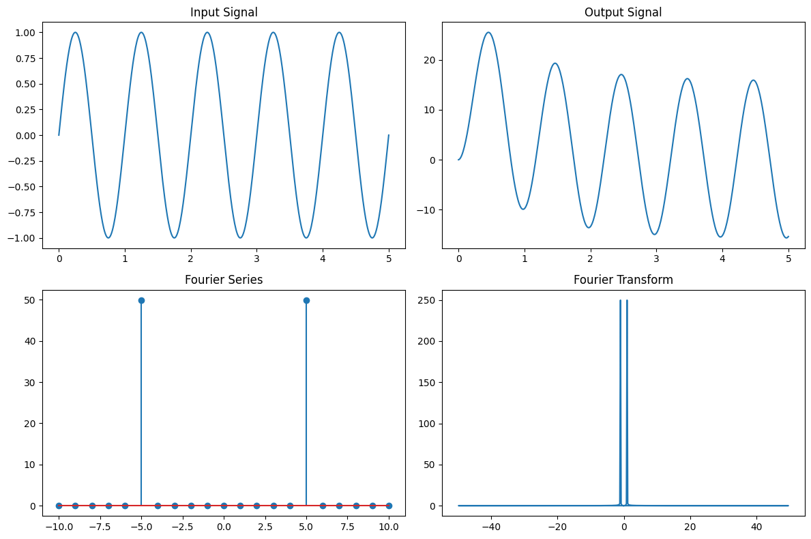

# Signal Analysis and Visualization Tool

This program is designed to calculate and visualize the impulse response, output signal, Fourier series coefficients, and Fourier transform of a given input signal.

## Prerequisites

- Python 3.x
- Required Python packages: numpy, matplotlib

## Installation

1. Clone the repository or download the code files.
2. Install the required packages by running the following command:

```
pip install numpy matplotlib
```

## Usage

1. Open the terminal or command prompt.
2. Navigate to the directory where the code files are located.
3. Run the program using the following command:

```
python Visualizer.py
```
4. The program will display the input signal, output signal, Fourier series coefficients, and Fourier transform.
5. The results will also be saved to a log file named `log.txt` in the same directory.

## Customization

- Modify the example input signal in the code to analyze different signals.
- Adjust the parameters and settings in the code to suit your specific analysis needs.
- Customize the plotting code to modify the appearance and layout of the generated plots.

## Examples

- The code includes an example usage section that demonstrates the analysis and visualization for a sine wave input signal.

## License

This project is licensed under the [MIT License](LICENSE).

## Acknowledgments

- The code was developed based on the concepts of signal processing and Fourier analysis.

